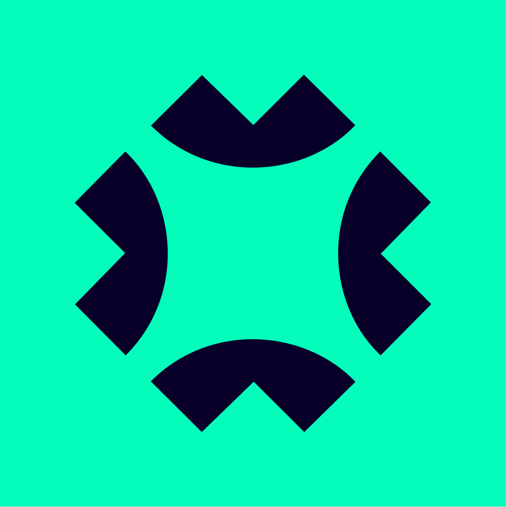
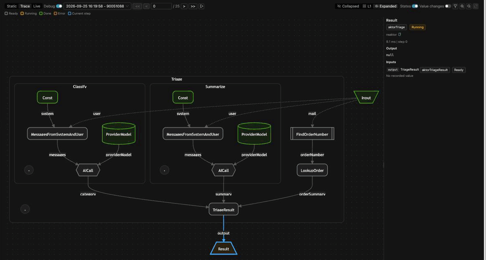
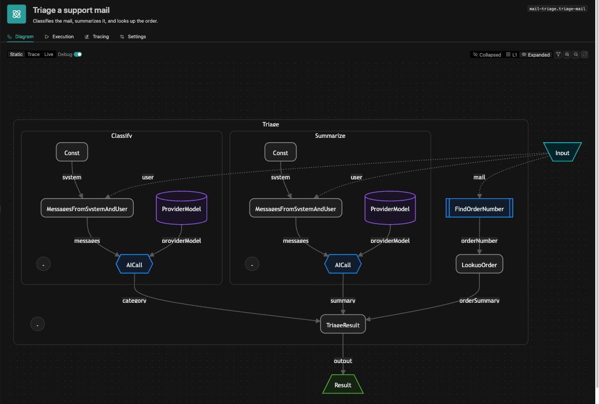
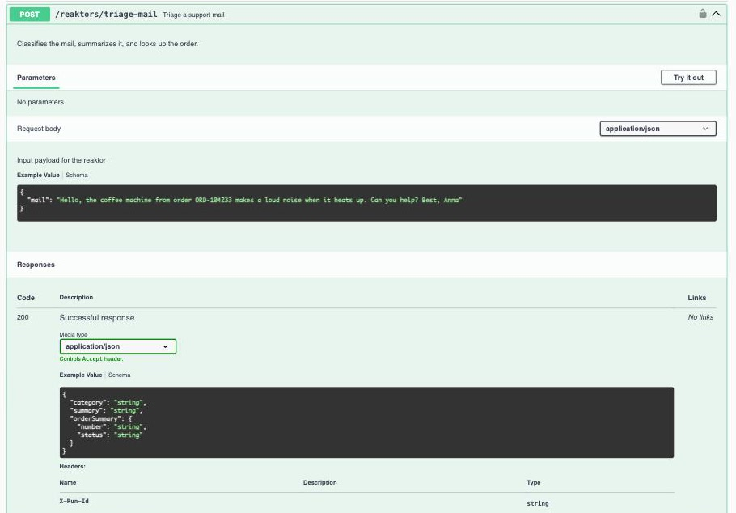
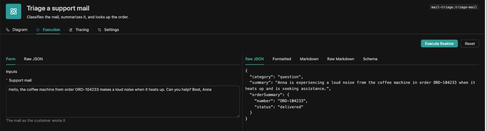

<p align="center">
  
</p>

<p align="center"><strong>Operaide Community Edition</strong> · Free · Invite-only</p>

<h1 align="center">Your AI app factory. Under your rules. Self-hosted.</h1>

<p align="center">Everyone builds apps now: you, and your colleagues by vibe coding.<br>Each app gets deployment, login, roles, audit and tracing from the factory, as TypeScript you can review.</p>

<p align="center">
  <a href="https://community-edition.operaide.ai/apply"><strong>Request access</strong></a><br>
  <sub>Use your personal GitHub account</sub>
</p>

## Run is the platform. Build is an extension.

<!-- App Builder screenshot: chat on the left, the running app in the preview on the right, the open model in the input field. -->

Every instance runs apps and covers their non-functional requirements. Switch on Build, and the same instance makes them too:

- **Describe it** in the App Builder. The agent plans, writes the code, checks it, and deploys it after every message. The way in for colleagues who do not code.
- **Code it** in Studio, a VS Code-style IDE in your browser: by hand, or with Claude Code, Codex or Operaide Code, all built in.

The best practices are encoded in every workspace: the handbook, the rules for agents, types and lint checks. Whichever agent writes the code, it builds the app the same way.

One instance can do both. Or run production without Build, and build on a second instance: every app is an npm package, every instance has a built-in npm registry, and apps move between instances like any other package.

## The vibe coding trap

We asked a model for this workflow. It wrote the two lines in the middle:

```typescript
// Not shown, but it will be there: an HTTP route, parsing and validating the body,
// deciding who may call it, reading the shop's API key from an environment variable.
const [category, summary] = await Promise.all([classify(mail), summarize(mail)]);
const order = await lookup(findOrderNumber(mail)); // waits for both LLM calls, though it needs neither
// Not shown either: the response, error handling and retries, a log of each step,
// an OpenAPI file, a Dockerfile, a deploy script.
```

The two lines in the middle are what you asked for. Everything around them is what you get: vibe coded too, a little differently in every app, and rarely reviewed. And the middle does not stay two lines: logging, error handling and timing creep into every step. With thirty steps instead of three, you also work out yourself what can run in parallel, again after every change.

## The way out

In Operaide you write the same steps as a composition and register it as a REST endpoint:

```typescript
const aktorTriage = createAktorComposition('aktorTriage', ({ mail }: { mail: Aktor<string> }) => {
    const category = aktorClassify({ mail }); // composition: prompt plus LLM call
    const summary = aktorSummarize({ mail }); // composition: prompt plus LLM call
    const orderNumber = aktorFindOrderNumber({ mail }); // function: plain TypeScript
    const orderSummary = aktorLookupOrder({ orderNumber }); // async function: calls the shop through a connector
    return aktorTriageResult({ category, summary, orderSummary }); // function: combines the results
});

// A REST endpoint: the schemas validate input and output, and generate the OpenAPI spec
registerReaktorDefinition({
    reaktorDefinitionId: 'triage-mail',
    label: 'Triage a support mail',
    description: 'Classifies the mail, summarizes it, and looks up the order.',
    aktor: aktorTriage,
    inputSchema: z.object({ mail: z.string() }),
    outputSchema: z.object({
        category: z.string(),
        summary: z.string(),
        orderSummary: z.object({ number: z.string(), status: z.string() }).nullable(),
    }),
});
```

The rest is already there: the endpoint and its OpenAPI spec come from the schemas, login and roles from the platform, the key sits in a connector, and every step is traced and drawn.

> [!NOTE]
> **Aktor** and **Reaktor** are words of our own.
> - An **Aktor** is a node in the graph below. Its inputs are named parameters, and each one is an edge labelled with its name. An Aktor is either a **function**, ordinary TypeScript with named parameters, sync or async, or a **composition**, which wires other Aktors into a graph. It is not an actor in the actor-model sense: it holds no state and exchanges no messages.
> - A **Reaktor** is a REST endpoint of an app, composed of Aktors. Its Zod input and output schemas generate the endpoint and its OpenAPI spec.



<sub>The order lookup starts last and finishes first: 574 ms, while each LLM call takes over a second.</sub>

A composition is declarative: it describes the graph and does not run it. That is why there is no `await`, and why the platform can run independent steps in parallel.

<details>
<summary><strong>The full example</strong>: connector, functions, compositions, endpoint</summary>

`shop-connection.ts`

```typescript
import { z } from 'zod';
import { registerConnectionType } from '@operaide/aktor';

// A connector: an admin enters URL and key once, in the platform
export const shop = registerConnectionType({
    type: 'shop',
    label: 'Shop',
    defaultConnectionName: 'shop',
    configSchema: z.object({
        baseUrl: z.string().url().describe('[label:Base URL]Where the shop API lives'),
        apiKey: z.string().describe('[label:API Key][secretFor:baseUrl]Sent to the shop with every request'),
    }),
});
```

`TriageMail.reaktor.ts`

```typescript
import axios from 'axios';
import { z } from 'zod';
import { aktorConst, createAktorComposition, createAktorFunction, registerReaktorDefinition } from '@operaide/aktor';
import type { Aktor } from '@operaide/aktor';
import { aktorAICall, aktorAISettingProviderModel, aktorMessagesFromSystemAndUser } from '@operaide/ai';
import { shop } from './shop-connection';

// Functions: plain TypeScript, sync or async, any npm package
const aktorFindOrderNumber = createAktorFunction(
    'aktorFindOrderNumber',
    ({ mail }: { mail: string }) => mail.match(/\bORD-\d{6}\b/)?.[0] ?? null
);

const aktorLookupOrder = createAktorFunction(
    'aktorLookupOrder',
    async ({ orderNumber }: { orderNumber: string | null }) => {
        if (!orderNumber) {
            return null;
        }
        const { baseUrl, apiKey } = await shop.getConnection('shop');
        const response = await axios.post<{ number: string; status: string }>(
            `${baseUrl}/shop-order`,
            { orderNumber },
            { headers: { 'api-key': apiKey } }
        );
        return response.data;
    }
);

const aktorTriageResult = createAktorFunction(
    'aktorTriageResult',
    (result: { category: string; summary: string; orderSummary: { number: string; status: string } | null }) => result
);

// Compositions: wire functions into a graph
const aktorClassify = createAktorComposition('aktorClassify', ({ mail }: { mail: Aktor<string> }) =>
    aktorAICall({
        messages: aktorMessagesFromSystemAndUser({
            system: aktorConst('Reply with one word: complaint, question, or order-change.'),
            user: mail,
        }),
        providerModel: aktorAISettingProviderModel(),
    })
);

const aktorSummarize = createAktorComposition('aktorSummarize', ({ mail }: { mail: Aktor<string> }) =>
    aktorAICall({
        messages: aktorMessagesFromSystemAndUser({ system: aktorConst('Summarize in one sentence.'), user: mail }),
        providerModel: aktorAISettingProviderModel(),
    })
);

const aktorTriage = createAktorComposition('aktorTriage', ({ mail }: { mail: Aktor<string> }) => {
    const category = aktorClassify({ mail }); // composition: prompt plus LLM call
    const summary = aktorSummarize({ mail }); // composition: prompt plus LLM call
    const orderNumber = aktorFindOrderNumber({ mail }); // function: plain TypeScript
    const orderSummary = aktorLookupOrder({ orderNumber }); // async function: calls the shop through a connector
    return aktorTriageResult({ category, summary, orderSummary }); // function: combines the results
});

// A REST endpoint: the schemas validate input and output, and generate the OpenAPI spec
registerReaktorDefinition({
    reaktorDefinitionId: 'triage-mail',
    label: 'Triage a support mail',
    description: 'Classifies the mail, summarizes it, and looks up the order.',
    aktor: aktorTriage,
    inputSchema: z.object({
        mail: z.string().describe('[label:Support mail][textarea]The mail as the customer wrote it').openapi({
            example:
                'Hello, the coffee machine from order ORD-104233 makes a loud noise when it heats up. Can you help? Best, Anna',
        }),
    }),
    outputSchema: z.object({
        category: z.string(),
        summary: z.string(),
        orderSummary: z.object({ number: z.string(), status: z.string() }).nullable(),
    }),
});
```

The shop is a Reaktor too: every Reaktor is an API.

`FakeShop.reaktor.ts`

```typescript
import { z } from 'zod';
import { createAktorComposition, createAktorFunction, registerReaktorDefinition } from '@operaide/aktor';
import type { Aktor } from '@operaide/aktor';

// Stands in for a real shop: any REST API works.
const aktorFindOrder = createAktorFunction('aktorFindOrder', async ({ orderNumber }: { orderNumber: string }) => {
    await new Promise((resolve) => setTimeout(resolve, 500));
    return { number: orderNumber, status: 'delivered' };
});

const aktorShopOrder = createAktorComposition('aktorShopOrder', ({ orderNumber }: { orderNumber: Aktor<string> }) =>
    aktorFindOrder({ orderNumber })
);

registerReaktorDefinition({
    reaktorDefinitionId: 'shop-order',
    label: 'Fake shop: look up an order',
    description: 'Stands in for a real shop API. Waits half a second and returns the order.',
    aktor: aktorShopOrder,
    inputSchema: z.object({ orderNumber: z.string().openapi({ example: 'ORD-104233' }) }),
    outputSchema: z.object({ number: z.string(), status: z.string() }),
});
```

The graph the platform draws from this code:



The OpenAPI spec generated from the schemas:



A run with the example mail:



</details>

## Where it runs

One Docker container on your infrastructure.

Build with any model you trust with your code. Run on a model that keeps your data in the house: self-hosted on your own hardware, or hosted in Germany. Because the architecture is decided in advance, building does not need a frontier model either.

Development: yes. Production: no. The Community Edition is licensed for building, testing and demos, paid client work included. Running a business on it needs a paid license. Going to production means adding a license key: same image, same apps, same data.

## Architecture decisions

- **TypeScript, not a language of our own.** Your editor knows it, and so does every model.
- **Words of our own.** Aktor and Reaktor mean nothing yet, so nobody assumes they know what they are: not you, and not your model.
- **An app is the unit.** It brings its own UI, its own roles and its own database, and runs in its own process. It is installed, updated and removed as one package.
- **Functions and compositions. That is all.** Functions do the work, compositions wire them into a graph. Parallelism, traces and diagrams come from the graph.
- **Every Reaktor is an API.** REST, with an OpenAPI spec generated from its schemas. Other apps, other Reaktors and your existing systems call it the same way.
- **The IDE lives inside the platform,** not the platform inside an IDE.
- **git and npm as the transport.** No package format of our own.
- **Best practices live in the workspace,** not in the agent. Any agent builds the same way.

## How to get in

1. **Request access** with your email and GitHub handle.
2. **We invite you** to this organization: the repositories, the handbook, the Discord server, and €5 of credit for models hosted in Germany from our partner Noirdoc.
3. **One container, one description.** `docker compose up`, add a model, switch on the App Builder, describe your first app.

This organization goes public after the preview, with everything written in it. Write as if it were public today.

<p align="center">
  <a href="https://community-edition.operaide.ai/apply"><strong>Request access</strong></a><br>
  <sub>Use your personal GitHub account: managed enterprise accounts cannot be invited</sub>
</p>

<p align="center"><sub>Operaide is a brand of objective partner AG · <a href="https://operaide.ai/legals/imprint">Imprint</a> · <a href="https://operaide.ai/legals/privacy-policy">Privacy Policy</a> · <a href="https://operaide.ai/contact">Contact</a></sub></p>
